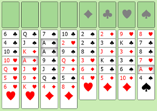

## The Tableau Helpers



(fig.1)

```
(new Tableau).init(12129).toString();

KH 6H 5H TD 5D 4C 6S 8D 
JC 2D 4H 8S KD 7D TC JH 
QS 2S QH 9D TS 6C KC 7C 
2C 9H 5S 9C 2H 7H AS 7S 
QC 3H 3D KS TH 3S 5C JS 
JD AD 6D 4D AH QD AC 9S 
4S 8H 8C 3C
```
