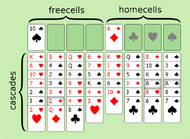

## Tableau and his helpers



(fig.1) game#11853 after 1. TS f

The tableau looks like this

```
JSON.stringify(tableau)

[[122,77,102,106,71,82,123,98,0,0,0,0,0,0,0,0,0,0,0,0],
[0,69,84,114,83,67,66,76,0,0,0,0,0,0,0,0,0,0,0,0],
[0,108,124,121,105,101,100,88,0,0,0,0,0,0,0,0,0,0,0,0],
[0,70,103,85,125,68,99,0,0,0,0,0,0,0,0,0,0,0,0,0],
[65,109,107,104,118,74,0,0,0,0,0,0,0,0,0,0,0,0,0,0],
[0,92,73,117,75,91,87,0,0,0,0,0,0,0,0,0,0,0,0,0],
[0,72,90,93,113,97,86,0,0,0,0,0,0,0,0,0,0,0,0,0],
[0,116,115,89,81,120,119,0,0,0,0,0,0,0,0,0,0,0,0,0]]
```

the human readable form is easier on the eyes

```javascript 
format(tableau, 'asString')

TS          AD          
KD 5D QH 6D KH QC 8D 4S 
6H 4C QS 7H JH 9D TC 3S 
TH 2S 9S 5C 8H 5S KC 9C 
7D 3C 9H KS 6S JD AS AC 
2C 3D 5H 4D TD JC AH 8S 
JS 2D 4H 3H    7C 6C 7S 
2H QD 8C 
```
the class Entry uses the ascii format.

```javascript 
format(tableau, 'asAscii')

z       A       
M E l F m \ H t 
f T | g k I Z s 
j r y U h u ] Y 
G S i } v K q Q 
R C e D J [ a x 
{ B d c   W V w 
b L X           
```

[Create an Entry Key »](entry.md)
